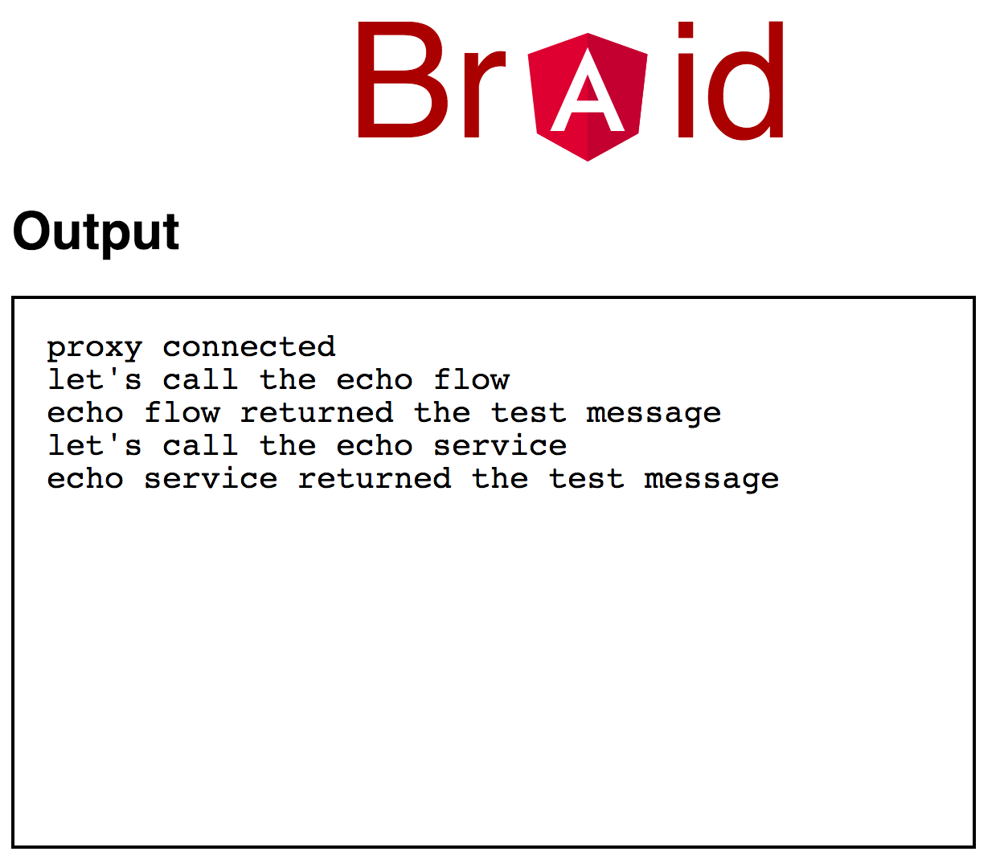

For `@lennertr` :-)

# Instructions

1. open this project in intellij (ensuring that gradle is all working)
2. run the `main` method in the file [NodeDriver.kt](./cordapp/src/test/kotlin/com/template/NodeDriver.kt)
(you will need to make sure the run configuration has the following VM options: `-ea -javaagent:lib/quasar.jar`)
3. you should note in the logs that braid end-points are create for PartyA and PartyB on `http://localhost:8081/api` and `http://localhost:8082/api` respectively.
4. please test that you can reach these in your browser
5. install the angular cli: `npm install -g @angular/cli`
6. in the [web](./web) directory start the angular server using: `ng serve --open`
7. if everything goes ok, you should see the following 

# Explanation

I'm not remotely familiar with the more recent versions of Angular - hopefully this translates to a proper solution.

The only thing I had to do was to define the `global` constant to be the `window` object in [index.html](./web/src/index.html).

Then, the main logic is in [app.component.ts](./web/src/app/app.component.ts)

